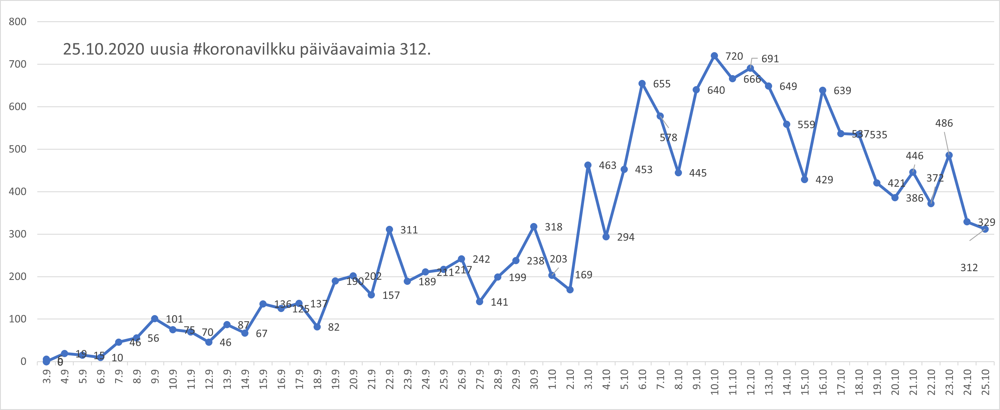

# Excel macros

Do not enable macro content before inspecting the code!

Älä aktivoi makroja ennenkuin olet tarkistanut koodin!

2021-02-16 Renamed as main branch.

# [HS-koronavirus-avoindata.xlsm](hs-koronavirus-avoindata/hs-koronavirus-avoindata.xlsm)

https://github.com/HS-Datadesk/koronavirus-avoindata data retrieval ja visualization. [More in hs-koronavirus-avoindata/](hs-koronavirus-avoindata/).

#  [all-exposure-checks.xlsx](all-exposure-checks/all-exposure-checks.xlsx)

Parsing COVID-19 Android exposure notification file all-exposure-checks.json into Excel graph. [More in all-exposure-checks/](all-exposure-checks/). Not updated.

