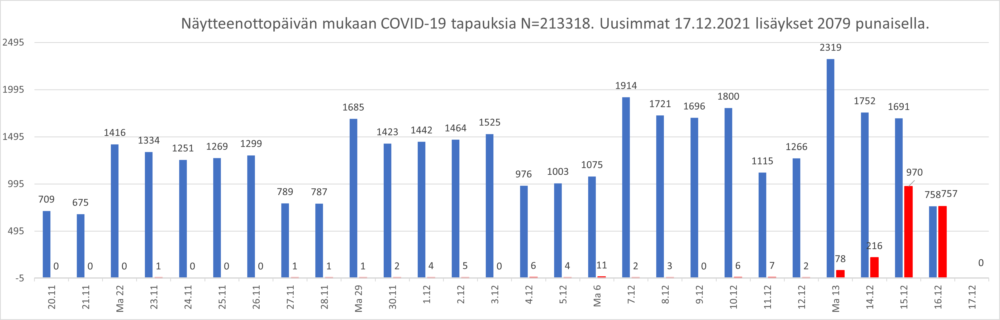
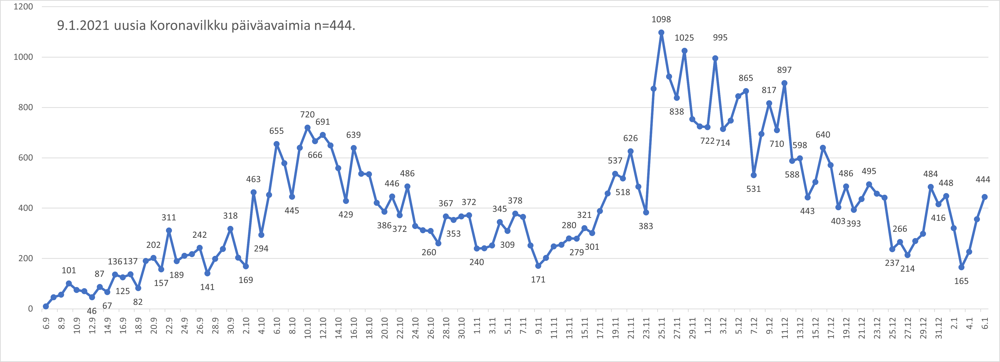

# Excel macros

Do not enable macro content before inspecting the code!

Älä aktivoi makroja ennenkuin olet tarkistanut koodin!

2021-02-16 Renamed as main branch.

# [hs-koronavirus-avoindata/](hs-koronavirus-avoindata/README.md)

https://github.com/HS-Datadesk/koronavirus-avoindata data retrieval ja visualization. [HS-koronavirus-avoindata.xlsm](hs-koronavirus-avoindata/hs-koronavirus-avoindata.xlsm). See also (https://github.com/jussivirkkala/R/tree/main/hs-koronavirus-avoindata)

#   [all-exposure-checks/](all-exposure-checks/README.md)

Parsing COVID-19 Android exposure notification file all-exposure-checks.json into Excel graph. [all-exposure-checks.xlsx](all-exposure-checks/all-exposure-checks.xlsx). Not updated.

