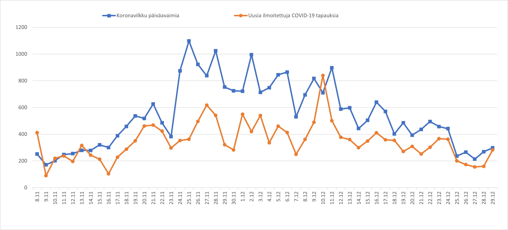

#  [all-exposure-checks.xlsx](all-exposure-checks.xlsx)

Parsing COVID-19 Android exposure notification file all-exposure-checks.json into Excel graph. No Excel macro needed. History data of https://www.koronavilkku.fi/. 

- 2020-01-07 Koronavilkku will included also EU daily keys so reporting key counts makes no sense anymore!
- 2020-11-24 Removed use of MAXIFS. Now working also with Excel 2016.
- 2020-11-22 Displaying values only on local minimum (below trace) and maximum (above trace).
- 2020-10-17 Number of shared daily keys depends on start of symptoms https://twitter.com/spheroid/status/1317109409869406209.
- 2020-10-05 Own folder https://github.com/jussivirkkala/excel/tree/master/all-exposure-checks.
- 2020-10-03 You can link directly to updated png.
- 2020-10-01 Calculating 7 days sum and #koronavilkku tweet template.
- 2020-09-27 Changed to line graph. See #koronavilkku information https://thl.fi/fi/web/hyvinvoinnin-ja-terveyden-edistamisen-johtaminen/ajankohtaista/koronan-vaikutukset-yhteiskuntaan-ja-palveluihin#Koronavilkkua
- 2020-09-26 First version. Supporting FIN, ENG (FIN/UK), SWE (FIN) until end of 2020 (format of times).

End
