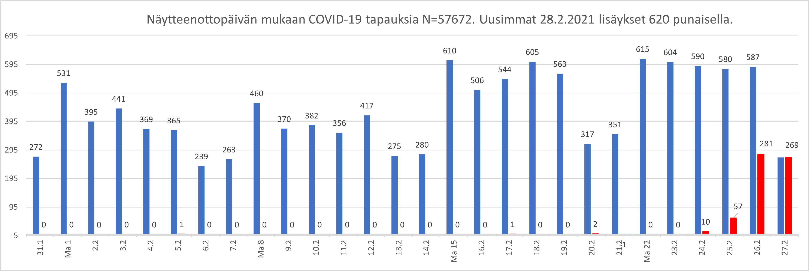
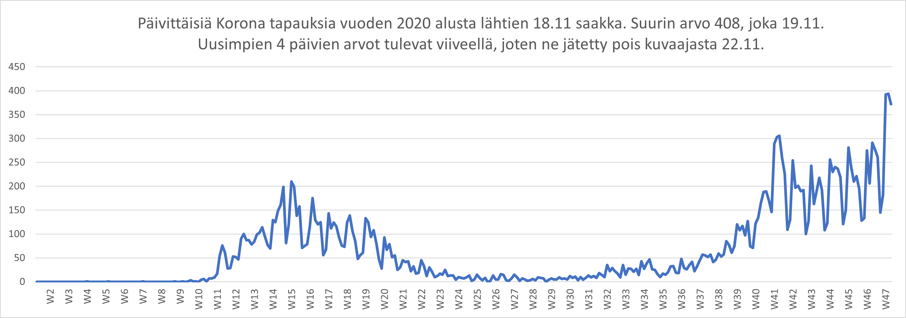

# Excel macros

Do not enable macro content before inspecting the code!

Älä aktivoi makroja ennenkuin olet tarkistanut koodin!

# [HS-koronavirus-avoindata.xlsm](hs-koronavirus-avoindata.xlsm)





https://github.com/HS-Datadesk/koronavirus-avoindata datan nouto ja visualisointi. 

- 2020-10-04 Updated data source to https://w3qa5ydb4l.execute-api.eu-west-1.amazonaws.com/prod/processedThlData.
- 2020-10-03 You can link directly to updated png.
- 2020-09-30 Corrected counting cases.
- 2020-09-29 Päivitetty datalähde https://w3qa5ydb4l.execute-api.eu-west-1.amazonaws.com/prod/finnishCoronaData/v2. Lähteessä ei enää maata eikä lähdettä. Poistettu automaattinen päivitys sekä ajastus. Päiväys on muuttunut tilastointipäiväksi https://thl.fi/fi/web/infektiotaudit-ja-rokotukset/ajankohtaista/ajankohtaista-koronaviruksesta-covid-19/tilannekatsaus-koronaviruksesta
- 2020-04-01 Datalähdettä ei päivitetä. THL uuden datan sijainti https://thl.fi/fi/tilastot-ja-data/aineistot-ja-palvelut/avoin-data/varmistetut-koronatapaukset-suomessa-covid-19-
- 2020-03-31 Korjattu kuvaajan x-akselin vaihtuminen esim. tallennuksen yhteydessä.
- 2020-03-16 Lisätty Päivitä painike. Lisätty sairaahoitopiirit Tilastot välilehdelle. Joissain koneissa "Virhe lukea ... Toiminnon aikakatkaisu" vaikka sivulle https://w3qa5ydb4l.execute-api.eu-west-1.amazonaws.com/prod/finnishCoronaData pääsee.
- 2020-03-15 Lisätty välilehdet. Puuttuvat id numerot eivät enää aiheuta tyhjiä riviä Data välilehdellä. Tämä helpottaa lajittelua ja auto filter käyttöä. Ei toimi myöskään Mac koneissa: Can't find project or library ServerXMLHTTP60
- 2020-03-14 Lisätty graafi. Joissain koneissa ei toimi: "Virhe tulkita dataa: ActiveX component can't create object".
- 2020-03-13 Ensimmäinen versio. Automaattinen ajastus ei toimi ensimmäisellä kerralla makron hyväksynnän jälkeen.

VBA koodi alla. On oltava nimettynä solu Data väliehdellä Tapauksia, jossa kaava =sum(A:A). Data kirjoitetaan rivistä 2 eteenpäin sarakkeille A-F
```
Option Explicit

' Hakee HS datasta Korona tapaukset
' https://github.com/HS-Datadesk/koronavirus-avoindata
' https://w3qa5ydb4l.execute-api.eu-west-1.amazonaws.com/prod/finnishCoronaData/v2
'
' https://github.com/jussivirkkala/excel/
' https://twitter.com/jussivirkkala
'
' 2020-10-27 Removed ActiveWorkbook.
' 2020-10-11 Storing previous 28 days values
' 2020-10-04 Updating to https://w3qa5ydb4l.execute-api.eu-west-1.amazonaws.com/prod/processedThlData. From 35 to 61
' 2020-10-03 Saving earlier daily increases.
' 2020-09-29 Changed data source to https://w3qa5ydb4l.execute-api.eu-west-1.amazonaws.com/prod/finnishCoronaData/v2.
' 2020-06-13 Added button.
' 2020-03-15 Dialog for no cases. Time of last get.
' 2020-03-14 More error handling. Modified text.
' 2020-03-13 First version.

Dim DIALOG As Boolean


' 2020-09-29 No automatic update
Sub Workbook_open_off()
    DIALOG = True
    If MsgBox("Haluatko hakea https://github.com/HS-Datadesk/koronavirus-avoindata myös 5 minuutin välein? Excel on oltava auki. Saat uusista tapauksista ilmoituksen.", _
    vbYesNo, Application.Name) = vbYes Then
        Timer
        DIALOG = False
    Else
        UpdateDialog
    End If
End Sub


Sub Timer()
    Update
    On Error GoTo err:
    Application.OnTime Now + TimeValue("00:05:00"), "ThisWorkbook.Timer"
    Exit Sub
err:
    MsgBox ("Ajastus ei onnistunut. Avaa tallennettu tiedosto uudestaan")
End Sub

Sub UpdateDialog()
    DIALOG = True
    Update
    DIALOG = False
End Sub

' 2020-10-01 Copy previous data
Sub Update()
    Dim DATA As String
    DATA = "https://w3qa5ydb4l.execute-api.eu-west-1.amazonaws.com/prod/finnishCoronaData"
    DATA = "https://w3qa5ydb4l.execute-api.eu-west-1.amazonaws.com/prod/finnishCoronaData/v2"
    DATA = "https://w3qa5ydb4l.execute-api.eu-west-1.amazonaws.com/prod/processedThlData"
            
    Dim i As Integer
    ' 2020-10-11 from 34 to 37, 62 to 65
    For i = 37 To 65
        Sheets("Kuvaajat").Cells(i, 16) = Sheets("Kuvaajat").Cells(i, 2)
        Sheets("Kuvaajat").Cells(i, 17) = Sheets("Kuvaajat").Cells(i, 3)
        Sheets("Kuvaajat").Cells(i, 18) = Sheets("Kuvaajat").Cells(i, 4)
    Next i
            
    
    ' GET data
    '
    On Error GoTo err_get
    Dim request
    Set request = New ServerXMLHTTP60
    request.Open "GET", DATA, False
    request.send

    ' Parse JSON
    '
    On Error GoTo err_json
    Dim sc, json
    Set sc = CreateObject("ScriptControl"): sc.Language = "JScript"
    ' request.responseTex = Replace(request.responseTex, ".value", ".Value")
    Set json = sc.Eval("(" + request.responseText + ")")
    
    Dim n As Long
    n = Sheets("Data").Range("Tapauksia")
    
    Dim row As Long
    row = 1
    Dim subject As Object
    Application.Calculation = xlCalculationManual
    For Each subject In CallByName(json.confirmed, "Kaikki sairaanhoitopiirit", VbGet)
        row = row + 1
        Sheets("Data").Cells(row, 1) = CallByName(subject, "value", VbGet)
         Dim d As String
        d = CallByName(subject, "date", VbGet)
        Sheets("Data").Cells(row, 2) = d
        Sheets("Data").Cells(row, 3) = subject.healthCareDistrict
'        Sheets("Data").Cells(row, 4) = subject.infectionSourceCountry
'        Sheets("Data").Cells(row, 5) = subject.infectionSource
        Sheets("Data").Cells(row, 6) = DateValue(Mid(d, 1, 10)) + TimeValue(Mid(d, 12, 8))
    Next

    On Error GoTo err_other
    Application.Calculation = xlCalculationAutomatic
    Application.Calculate ' 2020-03-30 .CalculatedFull
    If Sheets("Data").Range("Tapauksia") <> n Then
        MsgBox "Tapaukset ovat lisäntyneet " + Format(Sheets("Data").Range("Tapauksia").Value - n) + " kappaletta " _
        + Sheets("Data").Range("Paivitetty").Text + " jälkeen.", , Application.Name
        Sheets("Data").Range("Paivitetty") = datetime.Now()
        ' 2020- Copy previous data
        Dim j As Integer
        For j = 13 To 1000
            If Sheets("Kuvaajat").Cells(65, j) = "" Then Exit For
        Next j
        ' 2020-10-11 from 34 to 37, 62 to 65
        For i = 37 To 65
            Sheets("Kuvaajat").Cells(i, 13) = Sheets("Kuvaajat").Cells(i, 16)
            Sheets("Kuvaajat").Cells(i, 14) = Sheets("Kuvaajat").Cells(i, 17)
            Sheets("Kuvaajat").Cells(i, 15) = Sheets("Kuvaajat").Cells(i, 18)
            Sheets("Kuvaajat").Cells(i, j) = Sheets("Kuvaajat").Cells(i, 16)
            Sheets("Kuvaajat").Cells(i, j + 1) = Sheets("Kuvaajat").Cells(i, 17)
            Sheets("Kuvaajat").Cells(i, j + 2) = Sheets("Kuvaajat").Cells(i, 18)
            
        Next i
        ' 2020-10-05 Value
        'For i = 35 To 61
        '    Sheets("Kuvaajat").Cells(i, 10) = Sheets("Kuvaajat").Cells(i + 1, 10).Value
        '    Sheets("Kuvaajat").Cells(i, 11) = Sheets("Kuvaajat").Cells(i + 1, 11).Value
        '    Sheets("Kuvaajat").Cells(i, 12) = Sheets("Kuvaajat").Cells(i + 1, 12).Value
        'Next i
    Else
        If DIALOG Then MsgBox "Ei uusia tilastoituja tapauksia " + Sheets("Data").Range("Paivitetty").Text + " jälkeen.", , Application.Name
    End If
'    ActiveSheet.ChartObjects("Chart 1").Activate
'    ActiveChart.Axes(xlCategory).Select
'    ActiveChart.Axes(xlCategory).ReversePlotOrder = True
    Exit Sub

err_get:
    MsgBox "Virhe lukea " + DATA + ": " + err.Description
    Exit Sub
err_json:
    MsgBox "Virhe tulkita dataa: " + err.Description
    Exit Sub
err_other:
    MsgBox "Muu virhe: " + err.Description
End Sub

' End
```
